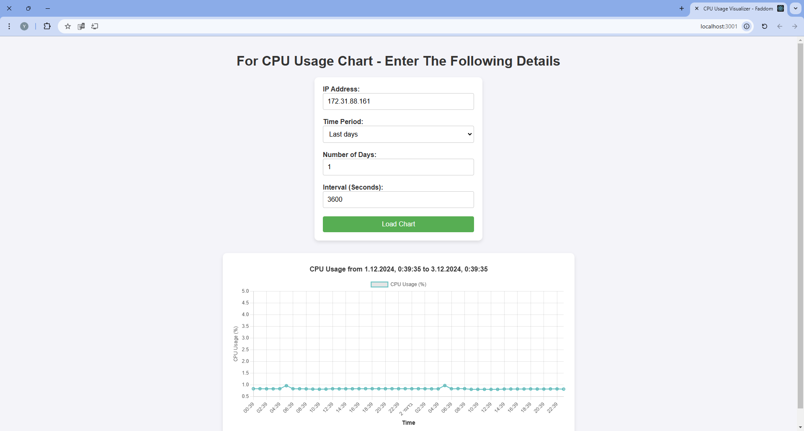

# Faddom Home Assignment

This repository contains the home assignment for Faddom. It demonstrates a full-stack application designed to extract performance metrics (CPU usage) from an AWS EC2 instance and display the data interactively in a web interface.

---

## Getting Started

Follow the instructions below to set up and run the application.

### Prerequisites

1. **Backend:**
   - Python 3.8 or later.
   - AWS account with proper CloudWatch permissions to access metrics.

2. **Frontend:**
   - Node.js 16 or later.
   - NPM (comes with Node.js).

---

## Setup Instructions

### Clone the Repository

1. Clone this repository to your local machine:

   ```bash
   git clone https://github.com/jlautman1/faddom_upload.git
   cd faddom_upload
## Backend Setup
1. Ensure python is installed
2. Install dependencies:
 ```bash
pip install boto3 flask flask-cors python-dotenv
```
3. Set environment variables:
Create a .env file in the root of the repository (same level as server.py) with the following content:

 ```bash
AWS_ACCESS_KEY_ID=your-access-key
AWS_SECRET_ACCESS_KEY=your-secret-key
AWS_REGION=your-region
```
4. Run the server:
```bash
python server.py
```
By default, the server will run on http://127.0.0.1:5000.

5. Test the server:

Navigate to http://127.0.0.1:5000 to verify the backend is running.

## Frontend Setup
1. Navigate to the frontend folder:
```bash
cd faddom-frontend
```
2. Install dependencies:
```bash
npm install
```
3. Run the frontend:
```bash
npm start
```
4. Access the application:
Open your browser and navigate to http://localhost:3000.

### Features
1. Interactive Input Form:

* Enter an IP address of the AWS EC2 instance.
* Select a time range (Last hours, Last days, or a custom range).
* Set the data sampling interval in seconds.
2. Dynamic Chart Display:

* The frontend visualizes CPU usage over time using Chart.js.
* Displays the time range and data points with clear axes and labels.
3. Loading Indicator:

* Displays a spinner while data is being fetched.
4. Customizable Backend:

*Built with Flask and AWS boto3 SDK for scalability.

### Environment Variables
* Store sensitive AWS credentials in a .env file, which is excluded from version control using .gitignore.
* Avoid uploading credentials to public repositories.

### Preview
Below is a preview of the user interface:


---

Feel free to contact me for any clarifications or additional requirements.
